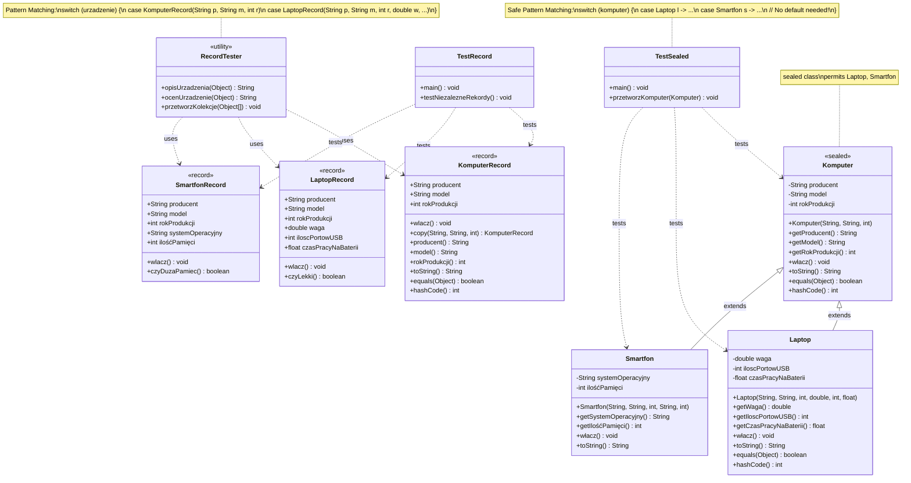

# Klasy, dziedziczenie, polimorfizm w Kotlinie


Projekt edukacyjny w Javie prezentujący koncepcje programowania obiektowego:
- **Klasy zapieczętowane (Sealed Classes)** - kontrola hierarchii dziedziczenia
- **Data class** - niezmienne klasy danych z automatycznymi metodami
- **Pattern Matching** - nowoczesne przetwarzanie typów z instanceof i switch
- **Polimorfizm** - dynamiczne wiązanie metod w hierarchii klas

Projekt zawiera również testy jednostkowe JUnit 5,
które weryfikują poprawność działania algorytmów
oraz metod.

---

## 📌 Spis treści
1. [Opis projektu](#opis-projektu)
2. [Technologie](#technologie)
3. [Instalacja](#instalacja)
4. [Użycie](#użycie)
5. [Przykład kodu](#przykład-kodu)
6. [Testy jednostkowe](#testy-jednostkowe)
7. [Diagram sekwencji](#diagram-sekwencji)
8. [Zrzuty ekranu](#zrzuty-ekranu)
9. [Uruchamianie testów](#uruchamianie-testów)
10. [Autor](#autor)
11. [Licencja](#licencja)


---

## 📝Opis projektu
Projekt ma na celu:
- Poznanie nowoczesnych funkcji Javy: sealed classes, records, pattern matching
- Wykorzystanie polimorfizmu oraz testów jednostkowych w JUnit 5
- Ćwiczenie pracy z hierarchią klas i interfejsów
- Demonstrację bezpiecznego pattern matching z sealed classes

### Główne koncepcje:
- **Sealed Classes**: Kontrola dziedziczenia przez `permits`
- **Data class**: Automatyczne generowanie equals, hashCode, toString oraz copy()
- **Pattern Matching**: Bezpieczne rzutowanie i dekonstrukcja typów
- **Polimorfizm**: Dynamiczne wywoływanie metod w hierarchii

---

## ⚙️Technologie
- **Kotlin, Java 21+** (wymagane dla data class, patterns i sealed classes)
- **JUnit 5** (testy jednostkowe)
- **Git** (kontrola wersji)

---

## 💻Instalacja
```bash
# Sklonuj repozytorium
git clone https://github.com/gacandrzej/Cw6KlasyDziedziczenieKt.git

# Przejdź do katalogu projektu
cd Cw6KlasyDziedziczenieKt

# Kompilacja Kotlin
kotlinc -d bin src/**/*.kt

# Uruchomienie 
java -cp bin rekord.TestRecordKt
java -cp bin sealed.TestSealedKt  
java -cp bin komputery.TestKomputerowKt
```

---

## 🚀Użycie

Projekt zawiera trzy główne moduły:

1. Data Classes (dataclass/)
- Demonstracja data classes jako niezmiennych klas danych
- Pattern matching z dekonstrukcją data classes
- Metody copy i automatyczne generowanie metod
```bash
  kotlinc -d bin src/dataclass/*.kt
  java -cp bin dataclass.TestDataClassKt
```
2. Sealed Classes (sealed/)
- Hierarchia zapieczętowanych klas
- Bezpieczny pattern matching w switch expressions
- Kontrola dziedziczenia przez permits
```bash
  kotlinc -d bin src/sealed/*.kt  
  java -cp bin sealed.TestSealedKt
```
3. Klasy dziedziczące. Polimorfizm (komputery/)
- Klasyczna hierarchia dziedziczenia
- Przesłanianie metod (@Override)
- Dynamiczne wiązanie metod
```bash
  kotlinc -d bin src/komputery/*.kt
  java -cp bin komputery.TestKomputerowKt
```

---

## 📌Przykład kodu
```kotlin
data class Komputer(
    val producent: String,
    val model: String,
    val rokProdukcji: Int
) : Urzadzenie {
    fun wlacz() {
        println("Komputer się uruchamia ...")
    }
}
```

---

## 🧪Testy jednostkowe

```kotlin
 class SmartfonTest {

    private lateinit var smartfon: Smartfon

    @BeforeEach
    fun setUp() {
        smartfon = Smartfon("Samsung", "Galaxy S21", 2022, "Android", 128)
    }

    @AfterEach
    fun tearDown() {
        // W Kotlinie nie musimy ręcznie ustawiać na null
    }

    @Test
    fun getProducent() {
        assertEquals("Samsung", smartfon.producent)
    }

    @Test
    fun getModel() {
        assertEquals("Galaxy S21", smartfon.model)
    }

    @Test
    fun getRokProdukcji() {
        assertEquals(2022, smartfon.rokProdukcji)
    }

    @Test
    fun getSystemOperacyjny() {
        assertEquals("Android", smartfon.systemOperacyjny)
    }

    @Test
    fun getIlośćPamięci() {
        assertEquals(128, smartfon.iloscPamieci) // Uwaga: zmienna nazywa się 'iloscPamieci' a nie 'ilośćPamięci'
    }

    @Test
    fun testToString() {
        // Sprawdźmy tylko czy zawiera kluczowe informacje, nie cały string
        val result = smartfon.toString()
        assertTrue(result.contains("Samsung"))
        assertTrue(result.contains("Galaxy S21"))
        assertTrue(result.contains("Android"))
        assertTrue(result.contains("128"))
    }

    @Test
    fun włacz() {
        // Test metody z efektem ubocznym
        smartfon.wlacz() // Uwaga: metoda nazywa się 'wlacz' a nie 'włacz'
    }

    @Test
    fun testEqualsAndHashCode() {
        val smartfon2 = Smartfon("Samsung", "Galaxy S21", 2022, "Android", 128)
        val smartfon3 = Smartfon("Apple", "iPhone 13", 2021, "iOS", 256)

        // Sprawdzamy właściwości ręcznie, bo to nie jest data class
        assertEquals(smartfon.producent, smartfon2.producent)
        assertEquals(smartfon.model, smartfon2.model)
        assertEquals(smartfon.rokProdukcji, smartfon2.rokProdukcji)
        assertEquals(smartfon.systemOperacyjny, smartfon2.systemOperacyjny)
        assertEquals(smartfon.iloscPamieci, smartfon2.iloscPamieci)

        assertNotEquals(smartfon.producent, smartfon3.producent)
        assertNotEquals(smartfon.model, smartfon3.model)
    }


}
```
Uruchamianie:
```bash
# Kompilacja kodu źródłowego i testów
kotlinc -cp junit-platform-console-standalone-1.10.0.jar -d bin src/**/*.kt test/**/*.kt

# Uruchomienie testów
java -jar junit-platform-console-standalone-1.10.0.jar --class-path bin --scan-class-path
```

---

## 📊Diagram sekwencji


---

## 🖼️Zrzuty ekranu


---

## 🏃Uruchamianie testów

Projekt zawiera skrypt `run_all_tests.sh`, który umożliwia:

- pobranie potrzebnych bibliotek JUnit 5,
- pobranie i zainstalowanie `junit2html`,
- kompilację kodu źródłowego i testów jednostkowych,
- uruchomienie testów i wygenerowanie raportów w formacie XML oraz HTML.

### Co robi skrypt

- Tworzy katalogi `bin/`, `libs/` i `reports/` (jeśli nie istnieją).
- Pobiera pliki JUnit (`junit-jupiter-api` i `junit-platform-console-standalone`) do `libs/`.
- Pobiera i instaluje `junit2html` (jeśli nie jest zainstalowany).
- Kompiluje kod źródłowy i testy do katalogu `bin/`.
- Uruchamia wszystkie testy jednostkowe i zapisuje wyniki w XML w katalogu `reports/`.
- Konwertuje raporty XML na HTML przy użyciu `junit2html`.

Pliki HTML powstają w katalogu `reports/` z nazwami:

- `report-jupiter.html`
- `report-platform.html`
- `report-vintage.html`

### Przykład raportu

Po uruchomieniu skryptu w katalogu `reports/` znajdziesz pliki HTML, które można otworzyć w przeglądarce, aby zobaczyć wyniki testów w czytelnej formie.

### Uruchomienie

W terminalu (Bash / Git Bash / Linux / Mac):

```bash
  ./run_all_tests.sh
```

---

## 👤Autor
- [GitHub: gacandrzej](https://github.com/gacandrzej)


- Email: [gacandrzej@gmail.com](mailto:gacandrzej@gmail.com)

---

## Licencja
- MIT License © 2025 Gac Andrzej